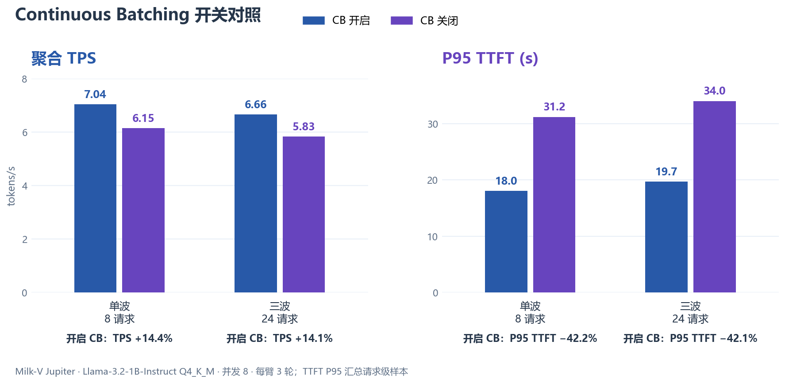

# Continuous Batching 开关对照实验

## 实验设计

唯一改变的服务端参数是 --cont-batching / --no-cont-batching。模型、服务端二进制、并发、线程、context、batch、prompt、输出长度和采样设置保持一致。脚本调用 [benchmark_llama.py](../../src/benchmark/benchmark_llama.py) 的 run_trial 复用流式 TTFT 和聚合 TPS 口径。

每个场景先对 CB 开启和关闭各跑 1 轮 Warmup 并丢弃，再各跑 3 轮计入结果。每轮固定先运行 CB 开启，再运行 CB 关闭。

| 场景 | 并发 | 每轮请求数 | 请求派发方式 | 用途 |
|---|---:|---:|---|---|
| 单波 | 8 | 8 | 8 个请求同时开始 | 观察无后续排队请求时的差异 |
| 三波 | 8 | 24 | 首波 8 个同时开始，之后 worker 空闲时继续派发 | 观察持续请求与排队下的差异 |

两臂均设置 --parallel 8；每请求输出上限 32 token，prompt 目标约 61 token，实际 prompt token 数从服务端 timings 记录。请求关闭 prompt cache。每臂 3 轮的输出 token 数一致，无请求丢失。

## 环境与指标

- 板卡：Milk-V Jupiter，SpacemiT K1 / X60，8 核 RISC-V，RVV 1.0。
- 系统：openEuler，Linux 6.18.38。
- 模型：Llama-3.2-1B-Instruct Q4_K_M。
- 服务端线程：-t 8 -tb 8；--parallel 8；-c 8192；-b 2048 -ub 512。
- 压测端：主机通过千兆以太网调用板卡 llama-server。

| 指标 | 口径 |
|---|---|
| 聚合 TPS | 本轮成功请求生成 token 总数 ÷ 客户端测得墙钟时间 |
| TTFT | 客户端发出请求到收到第一个流式 content token 的时间，包含服务端排队 |
| 平均 TTFT | 每轮请求级 TTFT 均值，再对 3 轮取均值；表中 ± 为轮间总体标准差 |
| P95 TTFT | 将同一场景、同一实验臂的 3 轮请求级 TTFT 合并后，按实验脚本的离散 P95 位置统计 |

## 结果

| 场景 | CB | TPS（均值 ± 标准差） | 平均 TTFT | P95 TTFT |
|---|---|---:|---:|---:|
| 单波（8 请求/轮） | 开启 | 7.04 ± 0.10 | 13.8 s | 18.0 s |
|  | 关闭 | 6.15 ± 0.08 | 18.9 s | 31.2 s |
| 三波（24 请求/轮） | 开启 | 6.66 ± 0.13 | 15.3 s | 19.7 s |
|  | 关闭 | 5.83 ± 0.07 | 26.0 s | 34.0 s |

相对关闭 CB，开启 CB 后：单波 TPS 提高 14.4%、P95 TTFT 降低 42.2%；三波 TPS 提高 14.1%、P95 TTFT 降低 42.1%。平均 TTFT 分别降低 27.1% 和 41.3%。



## 复现

需要主机侧 Python 依赖 paramiko、requests、numpy；绘图另需 matplotlib。设置板卡连接信息、板上二进制和模型路径；凭据仅通过环境变量提供，不写入仓库。SSH host key 需事先加入当前用户的 known_hosts。

```powershell
$env:BOARD_HOST = "<板卡地址>"
$env:BOARD_USER = "root"
$env:BOARD_PASS = "<SSH 密码>"
$env:LLAMA_SERVER_BIN = "/path/on/board/llama-server"
$env:LLAMA_MODEL_PATH = "/path/on/board/model.gguf"

# 仅显示两臂命令，不连接板卡
python src/benchmark/cb_ab.py --dry-run

# 三波：每轮 24 请求，每臂 3 轮，先丢弃 1 轮 Warmup
python src/benchmark/cb_ab.py --concurrency 8 --requests 24 --trials 3 --warmup 1 --tag cb8

# 单波：每轮 8 请求
python src/benchmark/cb_ab.py --concurrency 8 --requests 8 --trials 3 --warmup 1 --tag cb8_wave1

# 重绘结果图
python src/benchmark/plot_cb_ab.py
```

实验结果默认写入 tests/benchmark/cb-ab/。复现实验前请确认板卡上的二进制和模型与实验设置一致，并确保该端口没有其他 llama-server 服务。

## 随仓库提交的数据

- [三波原始结果 JSON](../../tests/benchmark/cb-ab/cb8_trials_20260917_191818.json) 与 [CSV 汇总](../../tests/benchmark/cb-ab/cb8_trials_20260917_191818.csv)
- [单波原始结果 JSON](../../tests/benchmark/cb-ab/cb8_wave1_trials_20260917_193610.json) 与 [CSV 汇总](../../tests/benchmark/cb-ab/cb8_wave1_trials_20260917_193610.csv)
- [结果图 SVG](../../tests/benchmark/cb-ab/charts/cb_compare.svg)
