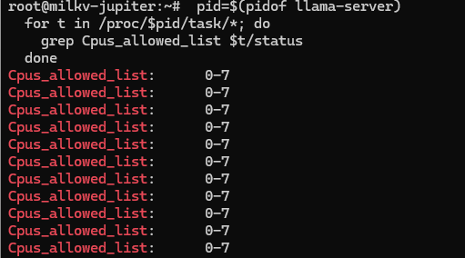
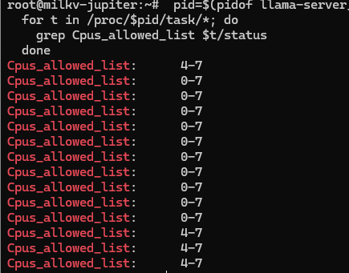
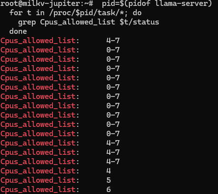

# \-Cr/\-Crb 无效的解决方案

1. 问题描述

使用 llama\-server 启动时使用参数指定 `-Cr 4-7 --cpu-strict 1 `期望将llama server 的计算线程对应绑定到 CPU 4\-7，但实际所有线程的 `Cpus_allowed_list`均为 0\-7，线程散布在所有核心上。



同时在同等启动条件下，llama\-bench 线程可以正确绑核。

2. 原因分析

Server 使用 `common_init_from_params` 初始化上下文，其内部调用 `common_context_params_to_llama`\(common\.cpp\)，该函数仅从 `cpuparams` 中复制 `n_threads` 和 `n_threads_batch` 两个字段，没有处理 `cpumask、mask_valid `和 `cpu_strict` 三个参数。后续`llama_new_context_with_model`创建上下文时，线程池仅获得线程数，无法应用任何 CPU绑定。

而 llama\-bench 在 `common_init_from_params `之后，额外调用了 `ggml_threadpool_params_from_cpu_params`\(common\.cpp\)，该函数读取 `mask_valid`，若为 true 则将 cpumask 完整复制到线程池参数中，再通过 `ggml_threadpool_new `创建线程池——每个 worker 线程在此阶段调用`ggml_thread_apply_affinity`\(ggml/src/ggml\-cpu/ggml\-cpu\.c\)，在 Linux 上通过 `pthread_setaffinity_np`将线程绑定到指定核心，最后通过 `llama_attach_threadpool` 将线程池挂载到上下文。

所以虽然命令行参数 `-Cr` 被正确解析并存储在`params.cpuparams.cpumask`中，但该数据在server初始化流程中被丢弃，从未传递给线程池。

3. 解决方案

在 tools/server/server\-context\.cpp 的模型加载函数`load_model`中，于`common_init_from_params`返回且`ctx_tgt`获取后，补充逻辑。具体实现：

- 通过 `ggml_backend_dev_by_type` 获取 CPU 后端设备

- 通过 `ggml_backend_reg_get_proc_address` 获取 `ggml_threadpool_new` 函数指针

- 调用 `ggml_threadpool_params_from_cpu_params` 将`params_base.cpuparams`转换为线程池参数

- 调用 `ggml_threadpool_new` 创建带 CPU 亲和性的线程池

- 调用 `llama_attach_threadpool` 将线程池挂载到上下文

    插入位置位于 server\-context\.cpp 第 1148 行`ctx_tgt = llama_init->context()`之后，`if(model_tgt == nullptr)`之前。插入代码如下：

    ```C++
    {
        auto * cpu_dev = ggml_backend_dev_by_type(GGML_BACKEND_DEVICE_TYPE_CPU);
        if (cpu_dev) {
            auto * reg = ggml_backend_dev_backend_reg(cpu_dev);
            auto * ggml_threadpool_new_fn = (decltype(ggml_threadpool_new) *) ggml_backend_reg_get_proc_address(reg, "ggml_threadpool_new");
            if (ggml_threadpool_new_fn) {
                struct ggml_threadpool_params tpp_batch =
                    ggml_threadpool_params_from_cpu_params(params_base.cpuparams_batch);
                struct ggml_threadpool_params tpp =
                    ggml_threadpool_params_from_cpu_params(params_base.cpuparams);
    
                struct ggml_threadpool * threadpool_batch = NULL;
                if (!ggml_threadpool_params_match(&tpp, &tpp_batch)) {
                    threadpool_batch = ggml_threadpool_new_fn(&tpp_batch);
                    if (!threadpool_batch) {
                        SRV_WRN("failed to create batch threadpool\n");
                    }
                    tpp.paused = true;
                }
    
                struct ggml_threadpool * threadpool = ggml_threadpool_new_fn(&tpp);
                if (threadpool) {
                    llama_attach_threadpool(ctx_tgt, threadpool, threadpool_batch);
                    SRV_INF("threadpool with cpumask attached to server context\n");
                }
            }
        }
    }
    ```

4. 验证

在WSL上重新交叉编译llama cpp源码，ssh传输到板卡上，使用命令启动llama server进程

```Bash
LD_LIBRARY_PATH=/root/llama/bin \
  /root/llama/bin/llama-server \
    -m /root/llama-3.2-1b-instruct-q4_k_m.gguf \
    -t 4 -tb 4 \
    -Cr 4-7 -Crb 4-7 \
    --parallel 4 -c 2048 --cont-batching --port 8080
```

查看llama server线程被允许的CPU

```Bash
pid=$(pidof llama-server)
for t in /proc/$pid/task/*; do
    grep Cpus_allowed_list $t/status
done
```

可以看到设置的计算线程成功被绑定在了4\-7核上，图中可见的仍能在 0\-7核上运行的为HTTP线程。



启动参数中加入\-\-cpu\-strict 1后，可以观察到三个计算线程被锁定在了三个核心上。




