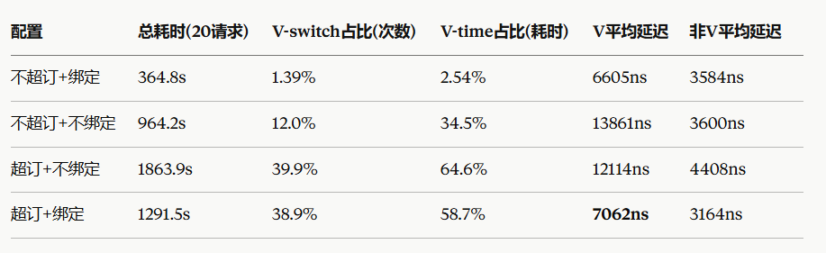

# 量化相关脚本

使用说明

1. 板子： llamserver

2. 板子：运行trace脚本

3. 主机：运行python发送请求

结束后，中断trace脚本

完成量化

注意：

https://forum\.spacemit\.com/t/topic/453 中

Cluster0 \(核心0\-3\)包含AI加速单元，支持IME扩展指令，而Cluster1 \(核心4\-7\)为通用计算核心，没有专用AI处理能力。IME扩展指令为Cluster0专属指令集，在Cluster1执行系统会自动规避核心。所以在测试AI性能的时候只能跑前4核。

# 实践

Llama\-server: Tag b10000

修改server\-context\.cpp，加入\-C修改

## 编译选项

```Bash
# RISCV
cmake .. -DCMAKE_BUILD_TYPE=RelWithDebInfo -DCMAKE_TOOLCHAIN_FILE=/mnt/e/gh/workspace/wslhome/workspace/claudePro/llamatest/llamame/llama.cpp/cmake/riscv64-spacemit-linux-gnu-gcc.cmake -DBUILD_SHARED_LIBS=ON \
  -DGGML_CPU_RISCV64_SPACEMIT=ON \
  -DGGML_CPU_REPACK=OFF \
  -DGGML_RVV=ON \
  -DGGML_RV_ZFH=ON \
  -DGGML_RV_ZVFH=ON \
  -DGGML_RV_ZBA=ON \
  -DGGML_RV_ZICBOP=ON \
  -DGGML_RV_ZIHINTPAUSE=ON \
  -DGGML_OPENMP=OFF \
  -DGGML_LTO=OFF \
  -DGGML_LLAMAFILE=ON \
  -DGGML_BLAS=OFF \
  -DLLAMA_OPENSSL=OFF \
  -DLLAMA_BUILD_SERVER=ON \
  -DLLAMA_BUILD_TESTS=OFF \
  -DLLAMA_BUILD_EXAMPLES=OFF \
  -DLLAMA_BUILD_UI=OFF \
  -DLLAMA_USE_PREBUILT_UI=OFF \
  -DCMAKE_SYSTEM_PROCESSOR=riscv64 \
  -DCMAKE_EXE_LINKER_FLAGS="-static-libstdc++ -static-libgcc" \
  -DCMAKE_SHARED_LINKER_FLAGS="-static-libstdc++ -static-libgcc"
  
# x86
cmake .. \
  -DCMAKE_BUILD_TYPE=RelWithDebInfo \
  -DGGML_AVX2=ON -DGGML_AVX512=OFF -DGGML_NATIVE=OFF \
  -DGGML_OPENMP=OFF \
  -DGGML_CUDA=OFF \
  -DGGML_METAL=OFF \
  -DGGML_VULKAN=OFF \
  -DGGML_SYCL=OFF \
  -DLLAMA_CURL=OFF \
  -DLLAMA_BUILD_EXAMPLES=ON \
  -DLLAMA_BUILD_TOOLS=ON \
  -DLLAMA_BUILD_TESTS=OFF \
  -DLLAMA_BUILD_UI=OFF \
  -DBUILD_SHARED_LIBS=OFF

make -j8


# 运行时
LD_LIBRARY_PATH=<lib目录> ./bin/llama-server -m <具体模型>
## 例如
LD_LIBRARY_PATH=/home/gh/workspace/llama/debug/install_output/lib ./bin/llama-server -m /home/gh/workspace/models/llama-3.2-1b-instruct-q4_k_m.gguf 
```

## 量化分组

运行注意事项：

RISCVserver运行时需要关闭大页分配

```Bash
# 去掉大页分配
export SPACEMIT_MEM_BACKEND=POSIX
```


```C

量化脚本运行顺序
开始：
@汪坤  板卡：V状态跟踪脚本，包含保存次数，恢复次数，带Dirty状态开销，不带Dirty状态开销 @汪坤基于RISCV脚本重写（我的没有恢复次数）
      板卡：./llama-server
@CXY  主机端：分解为20个线程，每个线程1个请求，等待每个处理完成，curl永不超时。量化P95TTFT，TTFT，延迟，吞吐。（每个请求都有记录）
python benchmark_run.py --platform riscv --ip IP --port PORT --mode MODE --prompt-tokens N --output-tokens M --trials T --output-dir DIR
请求全部结束后：
关闭server
关闭V状态跟踪脚本
统计数据。

分组
# x86 不采取任何策略
#1 1B 8并发 不限制核心

# RISCV 不采取任何策略

#1 1B 4并发 不限制核数
#2 1B 8并发 不限制核数
#3 1B 16并发 不限制核数
#4 3B 8并发 不限制核数
```


## 具体步骤

@指代不同终端

```Bash
@1
ifconfig

@1
# 确定频率
cat /sys/devices/system/cpu/cpu*/cpufreq/scaling_governor
# RISCV板卡：关闭大页
export SPACEMIT_MEM_BACKEND=POSIX

cd /home/gh/workspace
#1 
LD_LIBRARY_PATH=/home/gh/workspace/llama/debug/install_output/lib ./llama/debug/install_output/bin/llama-server -m /home/gh/workspace/models/llama-3.2-1b-instruct-q4_k_m.gguf  --parallel 8 -c 2048 --port 8080 --host 0.0.0.0
#2
LD_LIBRARY_PATH=/home/gh/workspace/llama/debug/install_output/lib ./llama/debug/install_output/bin/llama-server -m /home/gh/workspace/models/llama-3.2-1b-instruct-q4_k_m.gguf  --parallel 4 -c 1024 --port 8080 --host 0.0.0.0
#3
LD_LIBRARY_PATH=/home/gh/workspace/llama/debug/install_output/lib ./llama/debug/install_output/bin/llama-server -m /home/gh/workspace/models/llama-3.2-1b-instruct-q4_k_m.gguf  --parallel 16 -c 4096 --port 8080 --host 0.0.0.0
#4
LD_LIBRARY_PATH=/home/gh/workspace/llama/debug/install_output/lib ./llama/debug/install_output/bin/llama-server -m /home/gh/workspace/models/llama-3.2-3b-instruct-q4_k_m.gguf  --parallel 8 -c 2048 --port 8080 --host 0.0.0.0
#5
LD_LIBRARY_PATH=/home/gh/workspace/llama/debug/install_output/lib ./llama/debug/install_output/bin/llama-server -m /home/gh/workspace/models/llama-3.2-8b-instruct-q4_k_m.gguf  --parallel 8 -c 2048 --port 8080 --host 0.0.0.0

运行起来后==========

@2
cd /home/gh/workspace/mysched/trace_sh 
# 运行脚本
bpftrace -o result_server_1.txt v_compute_server.bt &
bpftrace -o result_server_2.txt v_compute_server.bt &
bpftrace -o result_server_3.txt v_compute_server.bt &
bpftrace -o result_server_4.txt v_compute_server.bt &
bpftrace -o result_server_5.txt v_compute_server.bt &
tail -f result_server_5.txt
tail -f result_server_4.txt
tail -f result_server_3.txt
tail -f result_server_2.txt
tail -f result_server_1.txt

运行起来后=========

@主机端
python python_send.py --platform riscv --ip 192.168.124.96 --port 8080 --mode all-at-once --output-tokens 256 --trials 1 --output-dir results1
python python_send.py --platform riscv --ip 192.168.124.96 --port 8080 --mode all-at-once --output-tokens 256 --trials 1 --output-dir results2hou
python python_send.py --platform riscv --ip 192.168.124.96 --port 8080 --mode all-at-once --output-tokens 256 --trials 1 --output-dir results3
python python_send.py --platform riscv --ip 192.168.124.96 --port 8080 --mode all-at-once --output-tokens 256 --trials 1 --output-dir results4
python python_send.py --platform riscv --ip 192.168.124.96 --port 8080 --mode all-at-once --output-tokens 256 --trials 1 --output-dir result5

结束后========
@1
Ctrl+c


@2
Ctrl+c
fg
Ctrl+c
```


# 参考：


## llamaserver运行脚本

```Bash
./llama/build_riscv_rvv/bin/llama-server -m models/llama-3.2-3b-instruct-q4_k_m.gguf --cpu-strict 1 --cpu-strict-batch 1 -t 4 --parallel 4 -c 2048 --cont-batching --port 8080 --host 0.0.0.0

```

## python发送脚本【参考】

使用时修改DEFAULT\_URL，默认发送20个请求，组间0\.5s，组内0\.2s

```Bash
#!/usr/bin/env python3
"""
向 llama.cpp 服务器发送请求的压测脚本（多线程发送 + 等待所有回应）。
支持两种模式：
  模式1：分组发送（组间间隔0.5s，组内请求间隔0.2s，每组请求数随机1~8）
  模式2：连续发送（全部并发，无间隔）
每个请求的预测 token 数从 [64, 256, 512, 1024] 中随机选择。
请求按间隔节奏提交到线程池，不阻塞等待每组完成，最终统一等待所有请求完成。
"""

import argparse
import random
import time
from concurrent.futures import ThreadPoolExecutor, as_completed

import requests

# 默认服务器地址（llama.cpp server 默认）
DEFAULT_URL = "http://192.168.124.87:8080/completion"

# 可选的输出 token 数量
# TOKEN_OPTIONS = [64, 256, 512, 1024]
TOKEN_OPTIONS = [64]

# 固定 prompt 前缀
PROMPT_BASE = (
    "The capital of France is Paris. The capital of Germany is Berlin. "
    "The capital of Italy is Rome. The capital of Spain is Madrid. "
)

def build_prompt(target_tokens: int) -> str:
    """构造一个长度大致为 target_tokens 的 prompt。"""
    words_per_token = 1.3
    num_words = int(target_tokens * words_per_token) + 10
    words = PROMPT_BASE.split()
    repeated = (words * ((num_words // len(words)) + 1))[:num_words]
    return " ".join(repeated)

def send_request(url: str, n_predict: int, timeout: int | None = None) -> dict:
    """发送单个请求并等待回应，返回包含耗时和状态的字典。"""
    prompt = build_prompt(n_predict)
    payload = {
        "prompt": prompt,
        "n_predict": n_predict,
        "temperature": 0.7,
        "stream": False,
    }
    start = time.perf_counter()
    try:
        resp = requests.post(url, json=payload, timeout=timeout,
                              proxies={"http": None, "https": None})
        elapsed = time.perf_counter() - start
        ok = resp.status_code == 200
        return {
            "ok": ok,
            "status_code": resp.status_code,
            "elapsed": elapsed,
            "n_predict": n_predict,
        }
    except Exception as e:
        elapsed = time.perf_counter() - start
        return {
            "ok": False,
            "error": str(e),
            "elapsed": elapsed,
            "n_predict": n_predict,
        }

def mode_grouped(url: str, count: int, max_workers: int):
    """
    模式1：分组发送。
    - 每组请求数随机（1~8），组内请求间隔 0.2s，组间间隔 0.5s
    - 所有请求提交到线程池后不等待每组完成
    - 最终统一等待所有请求完成
    """
    # 将 count 按随机大小（1~8）拆分成若干组
    groups = []
    remaining = count
    while remaining > 0:
        size = random.randint(1, min(8, remaining))
        groups.append(size)
        remaining -= size

    print(f"=== 模式1：分组发送（{len(groups)}组，总{count}请求，每组随机1~8个请求） ===")
    print(f"各组请求数: {groups}")
    total_start = time.perf_counter()
    all_futures = []

    with ThreadPoolExecutor(max_workers=max_workers) as executor:
        for group_idx, group_size in enumerate(groups):
            for req_idx in range(group_size):
                tokens = random.choice(TOKEN_OPTIONS)
                all_futures.append(executor.submit(send_request, url, tokens))
                print(f"组 {group_idx+1}: 提交 请求{req_idx+1}/{group_size}({tokens} tokens)")

                # 组内间隔（本组最后一个请求不需要等）
                if req_idx < group_size - 1:
                    time.sleep(0.2)

            # 组间间隔（最后一组不需要等）
            if group_idx < len(groups) - 1:
                time.sleep(0.5)

        print(f"\n所有请求已提交（{len(all_futures)} 个，线程池大小={max_workers}），等待全部完成...")
        results = [future.result() for future in as_completed(all_futures)]

    total_elapsed = time.perf_counter() - total_start
    print_results(results, total_elapsed)

def mode_continuous(url: str, count: int, max_workers: int):
    """
    模式2：连续发送。
    - 所有请求无间隔一次性提交到线程池
    - 最终统一等待所有请求完成
    """
    print(f"=== 模式2：连续发送{count}个请求（并发，线程池={max_workers}） ===")
    total_start = time.perf_counter()
    tokens_list = [random.choice(TOKEN_OPTIONS) for _ in range(count)]

    with ThreadPoolExecutor(max_workers=max_workers) as executor:
        futures = {
            executor.submit(send_request, url, tokens): idx
            for idx, tokens in enumerate(tokens_list, 1)
        }
        print(f"已提交 {len(futures)} 个请求到线程池，等待所有回应...")
        results = [future.result() for future in as_completed(futures)]

    total_elapsed = time.perf_counter() - total_start
    print_results(results, total_elapsed)

def print_results(results: list, total_elapsed: float):
    """打印汇总统计信息。"""
    total = len(results)
    ok_count = sum(1 for r in results if r.get("ok", False))
    fail_count = total - ok_count
    elapsed_list = [r["elapsed"] for r in results if r.get("ok", False)]
    avg_elapsed = sum(elapsed_list) / len(elapsed_list) if elapsed_list else 0
    max_elapsed = max(elapsed_list) if elapsed_list else 0
    min_elapsed = min(elapsed_list) if elapsed_list else 0

    print("\n--- 汇总 ---")
    print(f"总请求数: {total}")
    print(f"成功: {ok_count}, 失败: {fail_count}")
    print(f"总耗时: {total_elapsed:.2f}s")
    if elapsed_list:
        print(f"平均响应时间: {avg_elapsed:.3f}s")
        print(f"最大响应时间: {max_elapsed:.3f}s")
        print(f"最小响应时间: {min_elapsed:.3f}s")

    failures = [r for r in results if not r.get("ok", False)]
    if failures:
        print("\n失败详情:")
        for idx, r in enumerate(failures, 1):
            print(f"  {idx}. {r.get('error', 'unknown error')}")

def main():
    parser = argparse.ArgumentParser(description="llama.cpp server 压测脚本（多线程 + 等待回应）")
    parser.add_argument(
        "--url",
        default=DEFAULT_URL,
        help=f"服务器地址，默认为 {DEFAULT_URL}",
    )
    parser.add_argument(
        "--mode",
        choices=["grouped", "continuous"],
        default="grouped",
        help="测试模式：grouped=分组发送（默认），continuous=连续发送",
    )
    parser.add_argument(
        "--count",
        type=int,
        default=20,
        help="请求总数，默认为 20。grouped 模式下每组随机 1~8 个请求",
    )
    parser.add_argument(
        "--max-workers",
        type=int,
        default=10,
        help="线程池最大工作线程数，默认为 10",
    )
    args = parser.parse_args()

    if args.mode == "grouped":
        mode_grouped(args.url, args.count, args.max_workers)
    else:
        mode_continuous(args.url, args.count, args.max_workers)

if __name__ == "__main__":
    main()

```


## benchmark\_run量化

```Python
*#!/usr/bin/env python3*

import argparse
import csv
import json
import os
import random
import time
from concurrent.futures import ThreadPoolExecutor, as_completed
from datetime import datetime

import requests

DEFAULT_PORT = 8080
REQUEST_COUNT = 20
CLIENT_WORKERS = 10
# PROMPT_TOKEN_OPTIONS = [64, 256, 512, 1024]
PROMPT_TOKEN_OPTIONS = [64]
DEFAULT_OUTPUT_TOKENS = 8
PROMPT_BASE = (
    "The capital of France is Paris. The capital of Germany is Berlin. "
    "The capital of Italy is Rome. The capital of Spain is Madrid. "
)

def build_prompt(target_tokens: int) -> str:
    """按照文档示例构造长度大致为 target_tokens 的 Prompt。"""
    words_per_token = 1.3
    num_words = int(target_tokens * words_per_token) + 10
    words = PROMPT_BASE.split()
    repeated = (words * ((num_words // len(words)) + 1))[:num_words]
    return " ".join(repeated)

def p95_20(values):
    """20条请求排序后直接取第19条"""
    if len(values) != 20:
        return None
    return sorted(values)[18]

def send_request(url: str, prompt_target_tokens: int, n_predict: int, timeout=None) -> dict:
    """发送单个请求并等待完整响应；timeout=None 表示永不超时。"""
    prompt = build_prompt(prompt_target_tokens)
    payload = {
        "prompt": prompt,
        "n_predict": n_predict,
        "temperature": 0.7,
        *# 文档示例是非流式；为取得真实 TTFT，仅此处改为流式。*
        "stream": True,
    }
    started = time.perf_counter()

    try:
        with requests.Session() as session:
            session.trust_env = False
            *# 每条请求独立计时，起点紧邻 HTTP 发送调用。*
            started = time.perf_counter()
            with session.post(url, json=payload, timeout=timeout, stream=True) as response:
                response.raise_for_status()
                ttft_ms = None
                prompt_ms = None
                tokens = None
                predicted_ms = None
                request_tps = None

                for line in response.iter_lines(chunk_size=1, decode_unicode=True):
                    if not line or not line.startswith("data: "):
                        continue
                    data_text = line[6:]
                    if data_text == "[DONE]":
                        break
                    try:
                        event = json.loads(data_text)
                    except json.JSONDecodeError:
                        continue

                    token_ids = event.get("tokens")
                    has_token = isinstance(token_ids, list) and len(token_ids) > 0
                    if ttft_ms is None and (
                        has_token or event.get("content") not in (None, "")
                    ):
                        ttft_ms = (time.perf_counter() - started) * 1000

                    timings = event.get("timings", {})
                    if timings.get("prompt_ms") is not None:
                        prompt_ms = float(timings["prompt_ms"])
                    if timings.get("predicted_n") is not None:
                        tokens = int(timings["predicted_n"])
                    if timings.get("predicted_ms") is not None:
                        predicted_ms = float(timings["predicted_ms"])
                    if timings.get("predicted_per_second") is not None:
                        request_tps = float(timings["predicted_per_second"])

        e2e_ms = (time.perf_counter() - started) * 1000
        if None in (ttft_ms, prompt_ms, tokens, predicted_ms, request_tps):
            raise RuntimeError("响应中缺少 TTFT、Prompt 或 llama-server timings")

        return {
            "status": "ok",
            "error": "",
            "prompt_target_tokens": prompt_target_tokens,
            "n_predict": n_predict,
            "ttft_ms": ttft_ms,
            "prompt_ms": prompt_ms,
            "e2e_ms": e2e_ms,
            "predicted_ms": predicted_ms,
            "tps": request_tps,
            "tokens": tokens,
        }
    except Exception as exc:
        return {
            "status": "failed",
            "error": str(exc),
            "prompt_target_tokens": prompt_target_tokens,
            "n_predict": n_predict,
            "ttft_ms": "",
            "prompt_ms": "",
            "e2e_ms": (time.perf_counter() - started) * 1000,
            "predicted_ms": "",
            "tps": "",
            "tokens": 0,
        }

def make_groups(count):
    """按照文档示例将请求随机拆成每组1至8条。"""
    groups = []
    remaining = count
    while remaining > 0:
        size = random.randint(1, min(8, remaining))
        groups.append(size)
        remaining -= size
    return groups

def choose_prompt_tokens(fixed_prompt_tokens):
    if fixed_prompt_tokens is not None:
        return fixed_prompt_tokens
    return random.choice(PROMPT_TOKEN_OPTIONS)

def mode_grouped(
    url: str,
    fixed_prompt_tokens,
    output_tokens: int,
):
    """组内间隔0.2秒、组间间隔0.5秒，最后等待全部请求完成。"""
    groups = make_groups(REQUEST_COUNT)
    print(
        f"分组发送: {groups}，总请求数={REQUEST_COUNT}，"
        f"线程池={CLIENT_WORKERS}"
    )
    started = time.perf_counter()
    futures = {}
    request_id = 1

    with ThreadPoolExecutor(max_workers=CLIENT_WORKERS) as executor:
        for group_id, group_size in enumerate(groups, start=1):
            for request_in_group in range(1, group_size + 1):
                prompt_target_tokens = choose_prompt_tokens(fixed_prompt_tokens)
                future = executor.submit(
                    send_request,
                    url,
                    prompt_target_tokens,
                    output_tokens,
                )
                futures[future] = (request_id, group_id)
                request_id += 1
                if request_in_group < group_size:
                    time.sleep(0.2)
            if group_id < len(groups):
                time.sleep(0.5)

        print(f"已提交 {len(futures)} 条请求，等待全部完成...")
        results = collect_results(futures)

    return results, time.perf_counter() - started, groups

def mode_all_at_once(
    url: str,
    fixed_prompt_tokens,
    output_tokens: int,
):
    """按照文档示例一次性提交全部请求，最后等待全部完成。"""
    print(f"连续发送: 总请求数={REQUEST_COUNT}，线程池={CLIENT_WORKERS}")
    started = time.perf_counter()
    with ThreadPoolExecutor(max_workers=CLIENT_WORKERS) as executor:
        futures = {
            executor.submit(
                send_request,
                url,
                choose_prompt_tokens(fixed_prompt_tokens),
                output_tokens,
            ): (request_id, 1)
            for request_id in range(1, REQUEST_COUNT + 1)
        }
        results = collect_results(futures)
    return results, time.perf_counter() - started, [REQUEST_COUNT]

def collect_results(futures):
    results = []
    for future in as_completed(futures):
        result = future.result()
        result["request_id"], result["group_id"] = futures[future]
        results.append(result)
        if result["status"] == "ok":
            print(
                f"  Req-{result['request_id']:02d} Group={result['group_id']} "
                f"PromptN={result['prompt_target_tokens']} "
                f"OutputN={result['n_predict']} "
                f"TTFT={result['ttft_ms']:.1f}ms "
                f"Prompt={result['prompt_ms']:.1f}ms "
                f"E2E={result['e2e_ms']:.1f}ms "
                f"TPS={result['tps']:.2f} Tokens={result['tokens']}"
            )
        else:
            print(f"  Req-{result['request_id']:02d} FAILED: {result['error']}")
    return sorted(results, key=lambda row: row["request_id"])

def summarize(trial, results, wall_time, args, groups):
    successful = [result for result in results if result["status"] == "ok"]
    ttfts = [result["ttft_ms"] for result in successful]
    prompts = [result["prompt_ms"] for result in successful]
    e2es = [result["e2e_ms"] for result in successful]
    tps_values = [result["tps"] for result in successful]
    total_tokens = sum(result["tokens"] for result in successful)
    p95_ttft = p95_20(ttfts)
    p95_prompt = p95_20(prompts)
    p95_e2e = p95_20(e2es)

    return {
        "platform": args.platform,
        "url": args.url,
        "mode": args.mode,
        "trial": trial,
        "groups": ",".join(str(size) for size in groups),
        "requests": len(results),
        "successful": len(successful),
        "failed": len(results) - len(successful),
        "prompt_token_setting": (
            str(args.prompt_tokens)
            if args.prompt_tokens is not None
            else ",".join(str(value) for value in PROMPT_TOKEN_OPTIONS)
        ),
        "output_tokens": args.output_tokens,
        "wall_time_s": round(wall_time, 4),
        "aggregate_throughput_tps": round(total_tokens / wall_time, 4),
        "avg_tps": round(sum(tps_values) / len(tps_values), 4) if tps_values else "",
        "avg_ttft_ms": round(sum(ttfts) / len(ttfts), 2) if ttfts else "",
        "p95_ttft_ms": round(p95_ttft, 2) if p95_ttft is not None else "",
        "avg_prompt_ms": round(sum(prompts) / len(prompts), 2) if prompts else "",
        "p95_prompt_ms": round(p95_prompt, 2) if p95_prompt is not None else "",
        "avg_e2e_ms": round(sum(e2es) / len(e2es), 2) if e2es else "",
        "p95_e2e_ms": round(p95_e2e, 2) if p95_e2e is not None else "",
    }

def write_csv(path, rows, fieldnames):
    with open(path, "w", newline="", encoding="utf-8-sig") as file:
        writer = csv.DictWriter(file, fieldnames=fieldnames)
        writer.writeheader()
        writer.writerows(rows)

def main():
    parser = argparse.ArgumentParser()
    parser.add_argument("--ip", required=True, help="llama-server 所在主机的 IP 地址")
    parser.add_argument("--port", type=int, default=DEFAULT_PORT)
    parser.add_argument("--platform", choices=["x86", "riscv"], required=True)
    parser.add_argument(
        "--mode",
        choices=["grouped", "all-at-once"],
        default="grouped",
        help="grouped 是随机分组间隔发送，all-at-once 是 20 条请求一次性提交",
    )
    parser.add_argument(
        "--prompt-tokens",
        type=int,
        help="固定 Prompt 构造目标长度；不指定则从 64,256,512,1024 随机选择",
    )
    parser.add_argument(
        "--output-tokens",
        type=int,
        default=DEFAULT_OUTPUT_TOKENS,
        help="每条请求的最大输出 token 数，默认 8",
    )
    parser.add_argument("--trials", type=int, default=1)
    parser.add_argument("--output-dir", default="results")
    args = parser.parse_args()

    if not 1 <= args.port <= 65535:
        parser.error("--port 必须在 1 到 65535 之间")
    if args.trials < 1:
        parser.error("--trials 必须大于 0")
    if args.prompt_tokens is not None and args.prompt_tokens < 1:
        parser.error("--prompt-tokens 必须大于 0")
    if args.output_tokens < 1:
        parser.error("--output-tokens 必须大于 0")

    all_requests = []
    summaries = []
    runner = mode_grouped if args.mode == "grouped" else mode_all_at_once
    args.url = f"http://{args.ip}:{args.port}/completion"

    for trial in range(1, args.trials + 1):
        print(f"\nTrial {trial}/{args.trials}")
        results, wall_time, groups = runner(
            args.url,
            args.prompt_tokens,
            args.output_tokens,
        )
        for result in results:
            all_requests.append(
                {
                    "platform": args.platform,
                    "mode": args.mode,
                    "trial": trial,
                    **result,
                }
            )
        summaries.append(summarize(trial, results, wall_time, args, groups))

    os.makedirs(args.output_dir, exist_ok=True)
    timestamp = datetime.now().strftime("%Y%m%d_%H%M%S")
    prefix = f"quant_{args.platform}_{args.mode}_{timestamp}"
    request_path = os.path.join(args.output_dir, f"{prefix}_requests.csv")
    summary_path = os.path.join(args.output_dir, f"{prefix}_summary.csv")
    write_csv(
        request_path,
        all_requests,
        [
            "platform", "mode", "trial", "request_id", "group_id", "status", "error",
            "prompt_target_tokens", "n_predict", "ttft_ms", "prompt_ms", "e2e_ms",
            "predicted_ms", "tps", "tokens",
        ],
    )
    write_csv(summary_path, summaries, list(summaries[0].keys()))
    print(f"\n逐请求记录: {os.path.abspath(request_path)}")
    print(f"汇总记录:   {os.path.abspath(summary_path)}")

if __name__ == "__main__":
    main()

```


## x86trace脚本==与RISC\-V同样的插桩点【参考】

```Bash
#!/usr/bin/env bpftrace

#include <linux/sched.h>
#include <asm/fpu/types.h>

BEGIN {
    printf("Tracing x86 Context Switch Overhead grouped by FPU/AVX/AVX-512 (xfeatures)...\n");
    printf("Periodic reports printed every 10 seconds. Hit Ctrl-C for final summary.\n\n");
}

/* 1. 抓取 save_fpregs_to_fpstate 参数 (struct fpu 指针) */
kprobe:save_fpregs_to_fpstate {
    @fpu[cpu] = arg0;
}

/* 2. 解析当前 CPU 上切换时保存的 xfeatures 状态 */
kretprobe:save_fpregs_to_fpstate
/@fpu[cpu]/
{
    $fpu = (struct fpu *)@fpu[cpu];
    $xf = $fpu->fpstate->regs.xsave.header.xfeatures;

    // 记录当前 CPU 在本次切换中 Save 的 xfeatures 位图
    @curr_xf[cpu] = $xf;

    // 累计各独立特征的 Save 次数（全局与周期）
    @saves_total = count();
    @saves_interval = count();

    if ($xf & 0x04) { @avx_saves_total = count();    @avx_saves_interval = count(); }
    if ($xf & 0x20) { @opmask_saves_total = count(); @opmask_saves_interval = count(); }
    if ($xf & 0x40) { @zmm256_saves_total = count(); @zmm256_saves_interval = count(); }
    if ($xf & 0x80) { @zmm16_saves_total = count();  @zmm16_saves_interval = count(); }

    delete(@fpu[cpu]);
}

/* 3. 切换起点：记录时间戳，默认设置 xfeatures 位图为 0 */
tracepoint:sched:sched_switch {
    $cpu = cpu;
    @start_ns[$cpu] = nsecs;
    @curr_xf[$cpu] = 0; // 若本次切换未触发 save_fpregs_to_fpstate，则默认为 0 (无 AVX/FPU 保存)
}

/* 4. 切换终点：计算耗时，并以 xfeatures 位图作为 Hash Key 进行归类统计 */
kprobe:finish_task_switch* {
    $cpu = cpu;

    if (@start_ns[$cpu]) {
        $delta = nsecs - @start_ns[$cpu];
        $xf = @curr_xf[$cpu]; // 取出本次切换对应的 xfeatures bitmask 作为 Hash Key

        /* 全局统计：以 $xf 作为 Key 记录 stats (次数/平均/最小/最大) 和 直方图 */
        @lat_total_stats[$xf] = stats($delta);
        @lat_total_hist[$xf] = hist($delta);

        /* 10 秒周期统计：以 $xf 作为 Key 记录次数与平均耗时 */
        @interval_count[$xf] = count();
        @interval_avg[$xf] = avg($delta);

        delete(@start_ns[$cpu]);
        delete(@curr_xf[$cpu]);
    }
}

/* 5. 每 10 秒精简输出：仅显示各特征 Save 次数与按 $xf 归类的平均耗时 */
interval:s:10 {
    printf("\n--- 周期报告 [%s] (近 10 秒统计) ---\n", strftime("%H:%M:%S", nsecs));

    printf(">> 各特征 Save 触发频次:\n");
    printf("   Total FP Saves  : "); print(@saves_interval);
    printf("   AVX (bit2, 0x04): "); print(@avx_saves_interval);
    printf("   Opmask (bit5,0x20):"); print(@opmask_saves_interval);
    printf("   ZMM256(bit6,0x40): "); print(@zmm256_saves_interval);
    printf("   ZMM16 (bit7,0x80): "); print(@zmm16_saves_interval);

    printf("\n>> 按 xfeatures 位图 (Hash Key) 分类的切换耗时 (包含次数与平均耗时/ns):\n");
    print(@interval_count);
    print(@interval_avg);

    /* 清空周期临时数据 */
    clear(@saves_interval);
    clear(@avx_saves_interval);
    clear(@opmask_saves_interval);
    clear(@zmm256_saves_interval);
    clear(@zmm16_saves_interval);
    clear(@interval_count);
    clear(@interval_avg);
}

/* 6. 最终汇总报告 */
END {
    printf("\n================ 全局最终统计 SUMMARY (Entire Run) ================\n");

    printf("\n[1] FPU/AVX/AVX-512 各特征 Save 总频次:\n");
    printf("   Total FP Saves      : "); print(@saves_total);
    printf("   AVX (bit2, 0x04)    : "); print(@avx_saves_total);
    printf("   Opmask (bit5, 0x20) : "); print(@opmask_saves_total);
    printf("   ZMM256 (bit6, 0x40) : "); print(@zmm256_saves_total);
    printf("   ZMM16 (bit7, 0x80)  : "); print(@zmm16_saves_total);

    printf("\n[2] 按 xfeatures 位图(Hash Key)分类的上下文切换耗时统计:\n");
    printf("(Key 为 10 进制位图组合，例如: 0=普通/无AVX，4=AVX/YMM，228=全套AVX512):\n");
    print(@lat_total_stats);

    printf("\n[3] 各 xfeatures 状态的耗时分布直方图 (ns):\n");
    print(@lat_total_hist);

    /* 清理全局变量 */
    clear(@fpu);
    clear(@start_ns);
    clear(@curr_xf);
    clear(@saves_total);
    clear(@avx_saves_total);
    clear(@opmask_saves_total);
    clear(@zmm256_saves_total);
    clear(@zmm16_saves_total);
    clear(@lat_total_stats);
    clear(@lat_total_hist);
}
```

## x86脚本（Vsave\+Vrestore次数\+有/无Vsave的具体切换时间）

```SQL
#!/usr/bin/env bpftrace

/*
 * x86 V-state 综合观测脚本 (两阶段设计)
 * 阶段1(耗时对比): 不做comm过滤，统计系统级"有save/无save"切换的真实耗时差异
 * 阶段2(V状态活动量化): 仅对 llama-server 统计 save/restore 次数及各分量拆解
 */

BEGIN {
    printf("Tracing x86 V-state save/restore + context switch overhead...\n");
    printf("Phase 1 (overhead): system-wide, no filter\n");
    printf("Phase 2 (V-state activity): filtered to llama-server\n");
}

/* save entry：不过滤，记录fpu指针 + 标记本次切换有save(用于耗时分类,系统级) */
kprobe:save_fpregs_to_fpstate
{
    @fpu[cpu] = arg0;
    @save_happened[cpu] = 1;
}

/* save return：只在llama-server时做xfeatures分量拆解统计 */
kretprobe:save_fpregs_to_fpstate
/@fpu[cpu]/
{
    if (comm == "llama-server") {
        $fpu = (struct fpu *)@fpu[cpu];
        $xf = $fpu->fpstate->regs.xsave.header.xfeatures;

        @saves_total = count();
        if ($xf & 0x04) { @avx_saves = count(); }
        if ($xf & 0x20) { @opmask_saves = count(); }
        if ($xf & 0x40) { @zmm256_saves = count(); }
        if ($xf & 0x80) { @zmm16_saves = count(); }
        if ($xf & 0xe4) { @vec_saves = count(); }
    }
    delete(@fpu[cpu]);
}

/* restore：仅统计llama-server的restore次数(V状态活动量化,非耗时) */
kprobe:restore_fpregs_from_fpstate
/comm == "llama-server"/
{
    @restore_count = count();
}

/* 点A：切出阶段，不过滤，系统级记录起点时间戳 */
tracepoint:sched:sched_switch
{
    @start_ns[cpu] = nsecs;
    @save_happened[cpu] = 0;
}

/* 点B：切入完成，按save_happened分类耗时(系统级) */
kprobe:finish_task_switch.isra.0
/@start_ns[cpu]/
{
    $delta = nsecs - @start_ns[cpu];

    if (@save_happened[cpu]) {
        @with_save_total = @with_save_total + $delta;
        @with_save_count = count();
    } else {
        @without_save_total = @without_save_total + $delta;
        @without_save_count = count();
    }

    delete(@start_ns[cpu]);
    delete(@save_happened[cpu]);
}

END
{
    clear(@fpu);

    printf("\n========== [阶段1] 切换耗时 (系统级, 以save是否发生分类) ==========\n");
    printf("有 save 的切换 - 次数:       "); print(@with_save_count);
    printf("有 save 的切换 - 总耗时(ns): "); print(@with_save_total);
    printf("无 save 的切换 - 次数:       "); print(@without_save_count);
    printf("无 save 的切换 - 总耗时(ns): "); print(@without_save_total);

    printf("\n========== [阶段2] llama-server 的 V状态活动量化 ==========\n");
    printf("save 总次数(llama-server):  "); print(@saves_total);
    printf("向量相关(0xe4):             "); print(@vec_saves);
    printf("  avx (bit2):               "); print(@avx_saves);
    printf("  opmask (bit5):            "); print(@opmask_saves);
    printf("  zmm256 (bit6):            "); print(@zmm256_saves);
    printf("  zmm16 (bit7):             "); print(@zmm16_saves);
    printf("restore 总次数(llama-server): "); print(@restore_count);
}
```

## RISCV脚本【参考】

```Bash
#!/usr/bin/env bpftrace

#include <linux/sched.h>
#include <asm/processor.h>

BEGIN {
    printf("Tracing context switch overhead (With V‑state vs Without V‑state)...\n");
    printf("Hit Ctrl-C to finish and display final total statistics.\n");
    printf("Periodic reports will be printed every 10 seconds.\n");
}

/* 切出阶段：记录起点时间戳和 prev 任务的 V 状态 */
tracepoint:sched:sched_switch {
    $cpu = cpu;
    $prev = (struct task_struct *)curtask;

    @start_ns[$cpu] = nsecs;
    @prev_has_v[$cpu] = ($prev->thread.vstate.datap != 0);
}

/* 切入阶段：计算切换耗时，并按是否涉及 V 状态分类记录 */
kprobe:finish_task_switch* {
    $cpu = cpu;

    if (@start_ns[$cpu]) {
        $delta = nsecs - @start_ns[$cpu];
        $next = (struct task_struct *)curtask;

        $next_has_v = ($next->thread.vstate.datap != 0);
        $is_v_switch = (@prev_has_v[$cpu] || $next_has_v);

        if ($is_v_switch) {
            /* 累积到总统计 */
            @v_total_hist = hist($delta);
            @v_total_stats = stats($delta);
            /* 累积到当前阶段统计 */
            @v_interval_hist = hist($delta);
            @v_interval_stats = stats($delta);
        } else {
            @non_v_total_hist = hist($delta);
            @non_v_total_stats = stats($delta);
            @non_v_interval_hist = hist($delta);
            @non_v_interval_stats = stats($delta);
        }

        delete(@start_ns[$cpu]);
        delete(@prev_has_v[$cpu]);
    }
}

/* 每 10 秒输出一次阶段性统计，并清空阶段数据 */
interval:s:10 {
    printf("\n=== Periodic report at %s (since last report) ===\n",
           strftime("%H:%M:%S", nsecs));

    printf("--- V‑state switches ---\n");
    printf("Stats:\n");
    print(@v_interval_stats);
    printf("Histogram (ns):\n");
    print(@v_interval_hist);

    printf("--- Non‑V‑state switches ---\n");
    printf("Stats:\n");
    print(@non_v_interval_stats);
    printf("Histogram (ns):\n");
    print(@non_v_interval_hist);

    /* 清空阶段性数据，下一个 10 秒区间重新累积 */
    clear(@v_interval_stats);
    clear(@v_interval_hist);
    clear(@non_v_interval_stats);
    clear(@non_v_interval_hist);
}

END {
    printf("\n=== Final Total Statistics (entire run) ===\n");

    printf("--- V‑state switches ---\n");
    printf("Stats:\n");
    print(@v_total_stats);
    printf("Histogram (ns):\n");
    print(@v_total_hist);

    printf("--- Non‑V‑state switches ---\n");
    printf("Stats:\n");
    print(@non_v_total_stats);
    printf("Histogram (ns):\n");
    print(@non_v_total_hist);

    clear(@v_total_stats);
    clear(@v_total_hist);
    clear(@non_v_total_stats);
    clear(@non_v_total_hist);
    clear(@start_ns);
    clear(@prev_has_v);
}
```

## riscv脚本临时【全部测量】

```SQL
#!/usr/bin/bpftrace

  BEGIN {
      printf("Tracing RVV context switch save/restore + overhead...\n");
  }

  tracepoint:sched:sched_switch
  /args->prev_pid != args->next_pid/
  {
      $cpu = cpu;
      @start_ns[$cpu] = nsecs;

      $t    = (struct task_struct *)curtask;
      $regs = (struct pt_regs *)((uint64)$t->stack + 16384 - sizeof(struct pt_regs));
      $vs   = $regs->status & 0x0600;

      /* ====== save 侧 ====== */
      $prev_dirty = 0;
      if ($vs == 0x0600 && (uint64)$t->mm != 0) {
          @saves_total = count();
          @saves[args->prev_comm, args->prev_pid] = count();
          @cpu_saves[cpu] = count();
          @cpu_saves_by_proc[cpu, args->prev_comm] = count();
          @tid_cpu_saves[args->prev_pid, cpu] = count();
          $prev_dirty = 1;
      }
      @prev_has_v[$cpu] = $prev_dirty;

      @task_cache[args->prev_pid] = (uint64)$t;
      @task_start[args->prev_pid] = $t->start_time;

      /* ====== restore 侧 ====== */
      $cached = @task_cache[args->next_pid];
      if ($cached != 0) {
          $nt = (struct task_struct *)$cached;
          if ($nt->start_time == @task_start[args->next_pid]) {
              $nregs = (struct pt_regs *)((uint64)$nt->stack + 16384 - sizeof(struct pt_regs));
              $nvs   = $nregs->status & 0x0600;
              if ($nvs != 0 && (uint64)$nt->mm != 0) {
                  @restores_total = count();
                  @restores[args->next_comm, args->next_pid] = count();
                  @cpu_restores[cpu] = count();
                  @cpu_restores_by_proc[cpu, args->next_comm] = count();
                  @tid_cpu_restores[args->next_pid, cpu] = count();
              }
          }
      }
  }

  /* 计时终点：finish_task_switch */
  kprobe:finish_task_switch*
  {
      $cpu = cpu;
      if (@start_ns[$cpu]) {
          $delta = nsecs - @start_ns[$cpu];
          if (@prev_has_v[$cpu]) {
              @v_total_stats = stats($delta);
          } else {
              @non_v_total_stats = stats($delta);
          }
          delete(@start_ns[$cpu]);
          delete(@prev_has_v[$cpu]);
      }
  }

  interval:s:10
  {
      printf("\n--- %s ---\n", strftime("%H:%M:%S", nsecs));
      printf("saves total:    "); print(@saves_total);
      printf("restores total: "); print(@restores_total);
  }

  END
  {
      clear(@task_cache); clear(@task_start); clear(@start_ns); clear(@prev_has_v);
      printf("\n========== SUMMARY ==========\n");
      printf("saves total:    "); print(@saves_total);
      printf("restores total: "); print(@restores_total);

      printf("\n=== 每个核的 save 次数 ===\n");     print(@cpu_saves);
      printf("\n=== 每个核 save 的进程分布 ===\n"); print(@cpu_saves_by_proc);
      printf("\n=== 每个核的 restore 次数 ===\n");     print(@cpu_restores);
      printf("\n=== 每个核 restore 的进程分布 ===\n"); print(@cpu_restores_by_proc);
      printf("\n=== 每个线程(tid)在哪些核上发生过 save ===\n");  print(@tid_cpu_saves);
      printf("\n=== 每个线程(tid)在哪些核上发生过 restore ===\n"); print(@tid_cpu_restores);
      printf("\nsaves by proc:\n");    print(@saves);
      printf("restores by proc:\n"); print(@restores);

      /* 计时部分：仅在 kprobe 可用时有效 */
      printf("\n=== 计时 (需要 CONFIG_KPROBES=y) ===\n");
      printf("V-state 切换耗时 (ns):\n");  print(@v_total_stats);
      printf("非 V-state 切换耗时 (ns):\n"); print(@non_v_total_stats);
  }
```

## RISCV脚本edit【仅测量server】

```Bash
#!/usr/bin/bpftrace
/* 仅测量server */

BEGIN {
    printf("Tracing RVV context switch save/restore + overhead...\n");
}

tracepoint:sched:sched_switch
/args->prev_pid != args->next_pid/
{
    $cpu = cpu;
    @start_ns[$cpu] = nsecs;

    // 标记本次切换是否涉及 llama-server
    $is_llama = 0;
    if (args->prev_comm == "llama-server" || args->next_comm == "llama-server") {
        $is_llama = 1;
    }
    @is_llama[$cpu] = $is_llama;

    $t    = (struct task_struct *)curtask;
    $regs = (struct pt_regs *)((uint64)$t->stack + 16384 - sizeof(struct pt_regs));
    $vs   = $regs->status & 0x0600;

    /* ====== save 侧 ====== */
    $prev_dirty = 0;
    // 只统计被调度出去的进程是 llama-server 的情况
    if ($vs == 0x0600 && (uint64)$t->mm != 0 && args->prev_comm == "llama-server") {
        @saves_total = count();
        @saves[args->prev_comm, args->prev_pid] = count();
        @cpu_saves[cpu] = count();
        @cpu_saves_by_proc[cpu, args->prev_comm] = count();
        @tid_cpu_saves[args->prev_pid, cpu] = count();
        $prev_dirty = 1;
    }
    @prev_has_v[$cpu] = $prev_dirty;

    @task_cache[args->prev_pid] = (uint64)$t;
    @task_start[args->prev_pid] = $t->start_time;

    /* ====== restore 侧 ====== */
    // 只统计即将调度进来的进程是 llama-server 的情况
    $cached = @task_cache[args->next_pid];
    if ($cached != 0) {
        $nt = (struct task_struct *)$cached;
        if ($nt->start_time == @task_start[args->next_pid]) {
            $nregs = (struct pt_regs *)((uint64)$nt->stack + 16384 - sizeof(struct pt_regs));
            $nvs   = $nregs->status & 0x0600;
            if ($nvs != 0 && (uint64)$nt->mm != 0 && args->next_comm == "llama-server") {
                @restores_total = count();
                @restores[args->next_comm, args->next_pid] = count();
                @cpu_restores[cpu] = count();
                @cpu_restores_by_proc[cpu, args->next_comm] = count();
                @tid_cpu_restores[args->next_pid, cpu] = count();
            }
        }
    }
}

/* 计时终点：finish_task_switch */
kprobe:finish_task_switch*
{
    $cpu = cpu;
    // 只统计涉及 llama-server 的切换
    if (@start_ns[$cpu] && @is_llama[$cpu]) {
        $delta = nsecs - @start_ns[$cpu];
        if (@prev_has_v[$cpu]) {
            @v_total_stats = stats($delta);
        } else {
            @non_v_total_stats = stats($delta);
        }
        delete(@start_ns[$cpu]);
        delete(@prev_has_v[$cpu]);
        delete(@is_llama[$cpu]);
    }
}

interval:s:10
{
    printf("\n--- %s ---\n", strftime("%H:%M:%S", nsecs));
    printf("saves total:    "); print(@saves_total);
    printf("restores total: "); print(@restores_total);
}

END
{
    clear(@task_cache);
    clear(@task_start);
    clear(@start_ns);
    clear(@prev_has_v);
    clear(@is_llama);

    printf("\n========== SUMMARY ==========\n");
    printf("saves total:    "); print(@saves_total);
    printf("restores total: "); print(@restores_total);

    printf("\n=== 每个核的 save 次数 ===\n");     print(@cpu_saves);
    printf("\n=== 每个核 save 的进程分布 ===\n"); print(@cpu_saves_by_proc);
    printf("\n=== 每个核的 restore 次数 ===\n");     print(@cpu_restores);
    printf("\n=== 每个核 restore 的进程分布 ===\n"); print(@cpu_restores_by_proc);
    printf("\n=== 每个线程(tid)在哪些核上发生过 save ===\n");  print(@tid_cpu_saves);
    printf("\n=== 每个线程(tid)在哪些核上发生过 restore ===\n"); print(@tid_cpu_restores);
    printf("\nsaves by proc:\n");    print(@saves);
    printf("restores by proc:\n"); print(@restores);

    printf("\n=== 计时 (需要 CONFIG_KPROBES=y) ===\n");
    printf("V-state 切换耗时 (ns):\n");  print(@v_total_stats);
    printf("非 V-state 切换耗时 (ns):\n"); print(@non_v_total_stats);
}
```


## 结果示例

```Bash
# bpftrace vec_trace_v.bt
Attaching 5 probes...
Tracing context switch overhead (With V‑state vs Without V‑state)...
Hit Ctrl-C to finish and display final total statistics.
Periodic reports will be printed every 10 seconds.

--- 周期报告 [14:08:22] (近 10 秒统计) ---
[带 V 状态切换]
@v_interval_count: 8580
@v_interval_avg: 6255

[无 V 状态切换]
@non_v_interval_count: 9535
@non_v_interval_avg: 2897


--- 周期报告 [14:08:32] (近 10 秒统计) ---
[带 V 状态切换]
@v_interval_count: 16864
@v_interval_avg: 5798

[无 V 状态切换]
@non_v_interval_count: 647
@non_v_interval_avg: 6827


--- 周期报告 [14:08:42] (近 10 秒统计) ---
[带 V 状态切换]
@v_interval_count: 17681
@v_interval_avg: 5472

[无 V 状态切换]
@non_v_interval_count: 620
@non_v_interval_avg: 6820


--- 周期报告 [14:08:52] (近 10 秒统计) ---
[带 V 状态切换]
@v_interval_count: 17872
@v_interval_avg: 5500

[无 V 状态切换]
@non_v_interval_count: 798
@non_v_interval_avg: 6013


--- 周期报告 [14:09:02] (近 10 秒统计) ---
[带 V 状态切换]
@v_interval_count: 17209
@v_interval_avg: 5732

[无 V 状态切换]
@non_v_interval_count: 595
@non_v_interval_avg: 6720


--- 周期报告 [14:09:12] (近 10 秒统计) ---
[带 V 状态切换]
@v_interval_count: 17812
@v_interval_avg: 5441

[无 V 状态切换]
@non_v_interval_count: 633
@non_v_interval_avg: 6987


--- 周期报告 [14:09:22] (近 10 秒统计) ---
[带 V 状态切换]
@v_interval_count: 17786
@v_interval_avg: 5542

[无 V 状态切换]
@non_v_interval_count: 813
@non_v_interval_avg: 6041


--- 周期报告 [14:09:32] (近 10 秒统计) ---
[带 V 状态切换]
@v_interval_count: 17152
@v_interval_avg: 5658

[无 V 状态切换]
@non_v_interval_count: 604
@non_v_interval_avg: 6825


--- 周期报告 [14:09:42] (近 10 秒统计) ---
[带 V 状态切换]
@v_interval_count: 17988
@v_interval_avg: 6295

[无 V 状态切换]
@non_v_interval_count: 1120
@non_v_interval_avg: 6611


--- 周期报告 [14:09:52] (近 10 秒统计) ---
[带 V 状态切换]
@v_interval_count: 16198
@v_interval_avg: 5733

[无 V 状态切换]
@non_v_interval_count: 760
@non_v_interval_avg: 7096


--- 周期报告 [14:10:02] (近 10 秒统计) ---
[带 V 状态切换]
@v_interval_count: 17687
@v_interval_avg: 5281

[无 V 状态切换]
@non_v_interval_count: 703
@non_v_interval_avg: 7429


--- 周期报告 [14:10:12] (近 10 秒统计) ---
[带 V 状态切换]
@v_interval_count: 17698
@v_interval_avg: 5372

[无 V 状态切换]
@non_v_interval_count: 719
@non_v_interval_avg: 7516


--- 周期报告 [14:10:22] (近 10 秒统计) ---
[带 V 状态切换]
@v_interval_count: 18044
@v_interval_avg: 5216

[无 V 状态切换]
@non_v_interval_count: 642
@non_v_interval_avg: 7404


--- 周期报告 [14:10:32] (近 10 秒统计) ---
[带 V 状态切换]
@v_interval_count: 16762
@v_interval_avg: 5404

[无 V 状态切换]
@non_v_interval_count: 706
@non_v_interval_avg: 6770


--- 周期报告 [14:10:42] (近 10 秒统计) ---
[带 V 状态切换]
@v_interval_count: 17380
@v_interval_avg: 5341

[无 V 状态切换]
@non_v_interval_count: 854
@non_v_interval_avg: 6508


--- 周期报告 [14:10:52] (近 10 秒统计) ---
[带 V 状态切换]
@v_interval_count: 16481
@v_interval_avg: 6123

[无 V 状态切换]
@non_v_interval_count: 1099
@non_v_interval_avg: 5730


--- 周期报告 [14:11:02] (近 10 秒统计) ---
[带 V 状态切换]
@v_interval_count: 1530
@v_interval_avg: 4494

[无 V 状态切换]
@non_v_interval_count: 17104
@non_v_interval_avg: 2752


--- 周期报告 [14:11:12] (近 10 秒统计) ---
[带 V 状态切换]
@v_interval_count: 48
@v_interval_avg: 5388

[无 V 状态切换]
@non_v_interval_count: 18052
@non_v_interval_avg: 2706


--- 周期报告 [14:11:22] (近 10 秒统计) ---
[带 V 状态切换]
@v_interval_count: 28
@v_interval_avg: 5989

[无 V 状态切换]
@non_v_interval_count: 17779
@non_v_interval_avg: 2688


--- 周期报告 [14:11:32] (近 10 秒统计) ---
[带 V 状态切换]
@v_interval_count: 38
@v_interval_avg: 6169

[无 V 状态切换]
@non_v_interval_count: 18467
@non_v_interval_avg: 2725


--- 周期报告 [14:11:42] (近 10 秒统计) ---
[带 V 状态切换]
@v_interval_count: 86
@v_interval_avg: 4881

[无 V 状态切换]
@non_v_interval_count: 59245
@non_v_interval_avg: 2658


--- 周期报告 [14:11:52] (近 10 秒统计) ---
[带 V 状态切换]
@v_interval_count: 26
@v_interval_avg: 5850

[无 V 状态切换]
@non_v_interval_count: 55978
@non_v_interval_avg: 2659


--- 周期报告 [14:12:02] (近 10 秒统计) ---
[带 V 状态切换]
@v_interval_count: 94
@v_interval_avg: 4835

[无 V 状态切换]
@non_v_interval_count: 75931
@non_v_interval_avg: 2651


--- 周期报告 [14:12:12] (近 10 秒统计) ---
[带 V 状态切换]
@v_interval_count: 36
@v_interval_avg: 5844

[无 V 状态切换]
@non_v_interval_count: 19912
@non_v_interval_avg: 2703


--- 周期报告 [14:12:22] (近 10 秒统计) ---
[带 V 状态切换]
@v_interval_count: 40
@v_interval_avg: 6224

[无 V 状态切换]
@non_v_interval_count: 19223
@non_v_interval_avg: 2700


--- 周期报告 [14:12:32] (近 10 秒统计) ---
[带 V 状态切换]
@v_interval_count: 52
@v_interval_avg: 6156

[无 V 状态切换]
@non_v_interval_count: 18444
@non_v_interval_avg: 2711


--- 周期报告 [14:12:42] (近 10 秒统计) ---
[带 V 状态切换]
@v_interval_count: 40
@v_interval_avg: 6267

[无 V 状态切换]
@non_v_interval_count: 18159
@non_v_interval_avg: 2697


--- 周期报告 [14:12:52] (近 10 秒统计) ---
[带 V 状态切换]
@v_interval_count: 42
@v_interval_avg: 6486

[无 V 状态切换]
@non_v_interval_count: 18400
@non_v_interval_avg: 2685


--- 周期报告 [14:13:02] (近 10 秒统计) ---
[带 V 状态切换]
@v_interval_count: 28
@v_interval_avg: 6025

[无 V 状态切换]
@non_v_interval_count: 18200
@non_v_interval_avg: 2697


--- 周期报告 [14:13:12] (近 10 秒统计) ---
[带 V 状态切换]
@v_interval_count: 28
@v_interval_avg: 5985

[无 V 状态切换]
@non_v_interval_count: 18498
@non_v_interval_avg: 2693

^C
================ 全局最终统计 (Entire Run) ================

--- [带 V 状态切换 (With V-State)] ---
基础统计 (count:次数, average:平均, min:最小, max:最大耗时/ns):
@v_total_stats: count 271354, average 5606, total 1521388308


耗时分布直方图 (ns):
@v_total_hist:
[1K, 2K)              15 |                                                    |
[2K, 4K)          166296 |@@@@@@@@@@@@@@@@@@@@@@@@@@@@@@@@@@@@@@@@@@@@@@@@@@@@|
[4K, 8K)           65063 |@@@@@@@@@@@@@@@@@@@@                                |
[8K, 16K)          24475 |@@@@@@@                                             |
[16K, 32K)         13996 |@@@@                                                |
[32K, 64K)          1509 |                                                    |


--- [无 V 状态切换 (Without V-State)] ---
基础统计 (count:次数, average:平均, min:最小, max:最大耗时/ns):
@non_v_total_stats: count 416661, average 2796, total 1165147812


耗时分布直方图 (ns):
@non_v_total_hist:
[1K, 2K)           10702 |@                                                   |
[2K, 4K)          391523 |@@@@@@@@@@@@@@@@@@@@@@@@@@@@@@@@@@@@@@@@@@@@@@@@@@@@|
[4K, 8K)           11242 |@                                                   |
[8K, 16K)           3018 |                                                    |
[16K, 32K)           172 |                                                    |
[32K, 64K)             4 |                                                    |


@non_v_interval_avg: 2730

@non_v_interval_count: 2300


@v_interval_avg: 6366

@v_interval_count: 10
```

## 具体参考结果

超订：8线程 但线程掩码只有3\-5




[riscv\_trace\_已隔离4\-7\.txt](图片和附件/riscv_trace_已隔离4-7.txt)

x86结果

256token输入256输出 4并发

```C
LD_LIBRARY_PATH=. ./bin/llama-server -m ~/test/llama-3.2-1b-instruct-q4_k_m.gguf --parallel 4 -c 4096 --cont-batching --port 8080
```


```SQL
========== [阶段1] 切换耗时 (系统级, 以save是否发生分类) ==========
有 save 的切换 - 次数:       @with_save_count: 1153
有 save 的切换 - 总耗时(ns): @with_save_total: 9317743     平均值：8081（平均值非脚本输出，下同）
无 save 的切换 - 次数:       @without_save_count: 2355
无 save 的切换 - 总耗时(ns): @without_save_total: 10017264  平均值：4253

========== [阶段2] llama-server 的 V状态活动量化 ==========
save 总次数(llama-server):  @saves_total: 381
向量相关(0xe4):             @vec_saves: 381
  avx (bit2):               @avx_saves: 92
  opmask (bit5):            @opmask_saves: 381
  zmm256 (bit6):            @zmm256_saves: 75
  zmm16 (bit7):             @zmm16_saves: 381
  
restore 总次数(llama-server): @restore_count: 122
```


